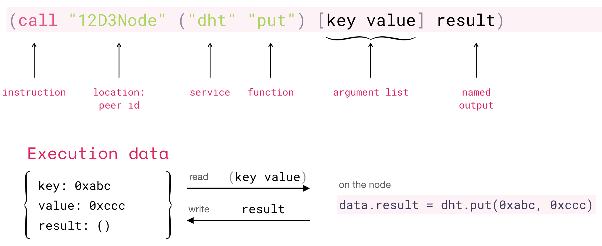

# Aquamarine

Aquamarine is a distributed choreography platform, controlled by AIR language


## AIR
### What is it?
*Aquamarine Intermediate Representation*

- S-expression-based low-level language
- Controls Fluence network and its peers
- Inspired by WAT (WebAssembly Text Format)
- Meant to be a compile target
- Development meant to happen in a higher-level language
- Syntax is in flux, will change

### Structure


### Instructions
#### seq: sequential
```s
(seq 
    (call "12D3Node"    ("dht"    "get") [key] value) 
    (call "12D3Storage" ("sqlite" "put") [key value] void)
) 
```

- `seq` takes two instructions
- executes them sequentially

#### par: parallel
```s
(par 
    (call "ClientA" ("chat" "display") [msg] void[]) 
    (call "ClientB" ("chat" "display") [msg] void[])
)
```

- `par` takes two instructions
- executes them in parallel

#### fold: iteration

1. Gather chat members by calling chat.members
2. Iterate through elements in members array, m = element
3. Each m is an object, represented as array; [0] is the first field
4. (next m) triggers next iteration
